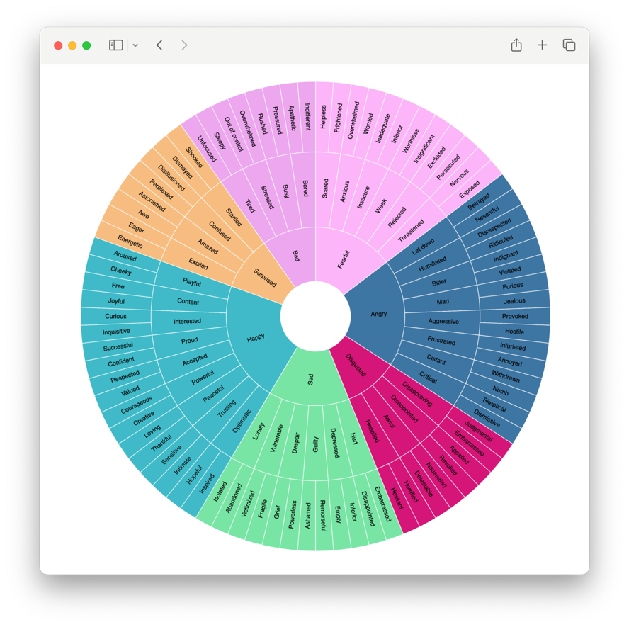

# `emotions-wheel-rs`



```bash
wasm-pack build --target web --dev && python3 -m http.server
```

---

One good refefence is [@mbostock/emotion-wheel](https://observablehq.com/@mbostock/emotion-wheel) on Observable:

> This is a recreation of Geoffrey Roberts’s Emotion Wheel using D3’s partition layout. Robert’s 2015 work appears to be based on a vocabulary wheel by Kaitlin Robbs from 2014, which in turn appears to be based on The Feeling Wheel published by Gloria Willcox in 1982.
